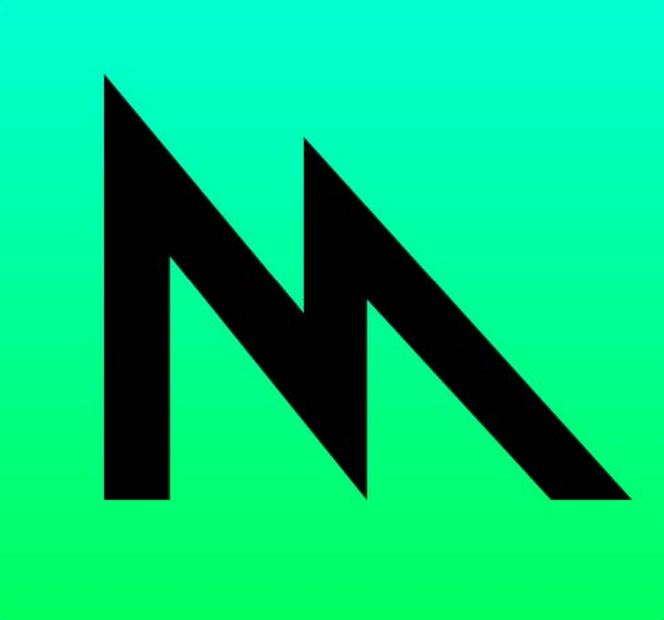

# metal-path-ios-app

iOS application sandbox that holds various Metal API related scenes, from very fundamental to advanced developments 🤖. The motivation behind the project is the following :

- Create a learning framework that allows to quickly prototype and experiment with `Metal API`.
- Dive deeper into `GPU` programming, which both involves `compute` and `rendering` sides. 
- Use the developments to reference them and potentially use some technical or conceptual sketches.

# Author 
[Astemir Eleev](https://github.com/jVirus)
